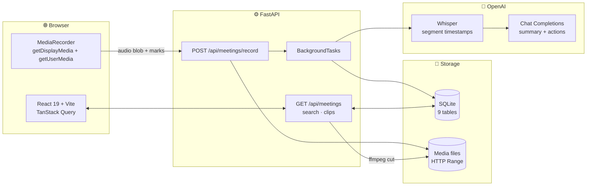

<div align="center">

# 🎙️ MEETLY AI
### An AI Meeting Notetaker

Record a call and get back a transcript that plays in sync, an AI summary you can re-cut by
template, action items, highlights you can mark while the meeting is still running,
search across every conversation, and a public clip link that works for someone who was never invited.


**8x Careers Engineering Assignment** · A 24-hour rebuild of [fathom.video](https://fathom.video),
then redesigned as its own product rather than a copy of one.

</div>

---

## 📋 Table of Contents

- [About the Project](#-about-the-project)
- [Try It in 60 Seconds](#-try-it-in-60-seconds)
- [Features](#-features)
- [System Architecture](#-system-architecture)
- [Design Decisions](#-design-decisions)
- [What Is Real and What Is Not](#-what-is-real-and-what-is-not)
- [Tech Stack](#-tech-stack)
- [Project Structure](#-project-structure)
- [Getting Started](#-getting-started)
- [API Reference](#-api-reference)
- [Deployment](#-deployment)
- [Agent Logs](#-agent-logs)
- [Notes](#%EF%B8%8F-notes)

---

## 📖 About the Project

A meeting happens, and afterwards nobody can find the part that mattered. Someone agreed to
something, a number was quoted, a risk was raised — and it is buried in fifty minutes of audio
nobody will replay.

**Meetly** closes that gap end to end:

1. It records the **meeting tab** in your browser — every participant, not just the microphone
   in front of you — mixed with your own voice.
2. **Whisper** transcribes it with per-segment timestamps, which is what lets the transcript
   follow playback and lets any line seek.
3. An **LLM** writes the summary, pulls action items, and names its own provenance so you always
   know which path produced what you are reading.
4. Anything worth keeping becomes a **highlight** — marked live during the call, or starred
   afterwards — and any range becomes a **clip** cut with ffmpeg, behind a link that needs no
   account.

The brief allowed the capture layer to be stubbed. It is not stubbed: the pipeline is real from
browser microphone to shared clip.

---

## ⚡ Try It in 60 Seconds

| Step | What to do |
|:-:|---|
| **1** | **Settings → AI** — paste an OpenAI key. Without one nothing is transcribed, and the app says so rather than inventing a transcript. |
| **2** | Start a call in Zoom, Meet or Teams — or just open any video. |
| **3** | Press **Record**, pick the tab, and tick **Share tab audio**. That captures everyone in the room. |
| **4** | While it runs, press **Mark this moment** whenever something matters. |
| **5** | Stop. The meeting appears as *Transcribing…* and fills itself in a few seconds. |
| **6** | Press play — the transcript follows along. Click any line to jump. Switch the summary template. |
| **7** | Your marks are already highlights. Hit **Share clip** and open the link in a private window. |
| **8** | Search a phrase from the call. Results land on the exact second. |

Prefer a populated workspace first? `python seed.py --demo` loads eight authored meetings,
badged **Demo data** everywhere they appear. The hard case is
**AI Platform Architecture Review** — eight people, 58 minutes.

---

## ✨ Features

### 🎥 Capture
- **Tab audio + microphone**, mixed through the Web Audio API, so remote participants are recorded
- **Live input meter** during recording — proof that audio is arriving, not just a running timer
- **Mid-call marking**: press a button while the call runs; each press becomes a highlight once
  the transcript resolves it
- Honest failure: if the tab was shared without audio, it says so instead of recording silence

### 📝 Understand
- **Synced transcript** — playback scrolls it, clicking a line seeks, scrolling away pauses following
- **Five summary templates** (General, Sales, Engineering, 1-on-1, Product). Switching re-reads the
  transcript rather than relabelling the same text
- **Action items** extracted with the summary, editable, counted across meetings
- **Highlights** in four categories, each playable and clippable
- **Provenance footer** — every summary names whether it came from the language model, local
  extraction, or hand-authored demo content

### 🔎 Find and Share
- **Cross-meeting search** over transcripts, titles, summaries, action items, highlights and
  participants — results land on the exact second
- **Clips** cut out of the stored audio with ffmpeg into their own file
- **Public share links** that open with no account, in a private window

---

## 🏗 System Architecture



**The processing pipeline**

```
audio → storage.save() → Whisper (segment timestamps) → summarise
      → resolve mid-call marks → ready
```

Upload returns immediately and the work happens in a background task, because transcription takes
seconds to minutes and a request should not hold that open. The meeting is created straight away
with a `processing` status, the UI polls it, and any failure is written onto the meeting so the
page can say what broke instead of spinning on *Processing* forever.

---

## 🎨 Design Decisions

> Fathom was the **reference, not the blueprint**. Every difference below is a decision I can
> defend, not a limitation I ran into.

### The transcript stopped being a tab
In Fathom the transcript sits beside the summary as one of several tabs, so reading a summary
point and checking what was actually said means leaving one for the other. Here it is a
**permanent rail** down the right of the meeting page. It is the source every other panel is
derived from, so it should not be something you navigate away from.

### Navigation moved to the top
A left sidebar spends 240px of every screen restating five destinations you already know. A top
bar gives that width back to the transcript — the only thing on the page that benefits from
being wider.

### Lists became ledgers, not card stacks
Every row starts with a fixed-width column holding the clock time, then the title and one line
of summary, grouped under **day headings that stick while you scroll**. Because the column is
fixed, a long list lines up on one axis and can be scanned without being read. Cards look more
designed and scan worse.

### Filters moved into a rail
They are the state of the page, not a one-off action, so they stay visible while you scroll. Each
person carries a count taken from the **unfiltered** set, so a name never reads as zero because a
different filter is hiding it.

### Search answers a second question
*Which* meetings a phrase turns up in is information in itself, so the result breakdown is a rail
of meetings with hit counts that also filters the results — not a line of prose above a flat list.

### The palette is paper, not dashboard
Warm neutrals, a burnt-amber accent, square surfaces, hairline rules. A meeting archive is
something you **read**, and reading surfaces should not glare. The accent is reserved for the
playhead and the primary action, so it never becomes decoration.

### Summaries say where they came from
An AI notetaker that will not tell you which of its output is AI is asking for trust it has not
earned. One line under every summary names the path that produced it.

### 🔄 A thing I built and then cut
The meeting page was first built around a **speaker-lane timeline** — one horizontal lane per
person, showing who dominated and where the room went quiet. It was the most interesting thing in
the build and I was attached to it. Shown the running product, it read as a data visualisation
sitting where a player belonged: you could see the shape of the call but not watch it. I put the
recognisable player back.

*The timeline is the better artefact. The player is the better product.*

### What I did **not** change
Mid-call marking, template switching, quote-anchored highlights and public clip links are Fathom's
ideas and they are correct. Changing them to look different would have been decoration, not
judgement.

### What I deliberately left out

| Cut | Why |
|---|---|
| **A bot that joins the call** | Days of infrastructure, no product insight. Sharing the meeting tab records the same audio. The brief permits the stub; I took it and said so. |
| **Accounts and login** | The brief requires the live link to open for someone not signed in. A login wall works directly against that. Adding auth later means a `user_id` column and a filter per query. |
| **Semantic search** | Keyword search across six sources answers *where was that said* and ships in hours. Embeddings plus a vector index is a week. |
| **Citations on the authored summary** | Template sections **do** cite exact timestamps, because each point is a quoted line. Paraphrased points do not: fuzzy-matching a paraphrase back to a line produces confident jumps to the wrong moment. A wrong citation is worse than none. |
| **Redaction, shared reels, CRM** | Real needs raised in the seeded conversations, deliberately out of scope for one day. |

---

## 🔍 What Is Real and What Is Not

Every meeting carries a badge saying which it is, so authored demo content is never mistaken for
live output.

| Layer | Status |
|---|---|
| **Database and API** | ✅ **Real.** Every endpoint reads and writes SQLite through SQLAlchemy. No endpoint returns a canned payload. |
| **Browser recording** | ✅ **Real.** Captures the shared meeting tab — all participants — mixed with your microphone. |
| **Mid-call marking** | ✅ **Real.** Marks travel with the upload and resolve against the transcript once it exists. |
| **Media storage** | ✅ **Real.** Audio written to disk under a generated filename, served with HTTP Range — which is what makes seeking work at all. |
| **Transcription** | ✅ **Real** with an API key (Whisper, per-segment timestamps). Without a key nothing is transcribed and the transcript says so. |
| **AI summary** | ✅ **Real.** LLM with a key, local extraction without. Both paths validate the response before storing it. |
| **Clips** | ✅ **Real.** `ffmpeg` cuts the range out of the stored audio into its own file. |
| **Public sharing** | ✅ **Real**, and genuinely public — no account needed. |
| **Demo meetings** | 📝 **Authored.** Eight meetings written by hand so the product demonstrates before you record anything. They are rows in the same database, created by the same seeder, badged **Demo data**. |
| **Calendar OAuth** | ⚠️ **Placeholder**, and the only one. Labelled in the UI *and* in the API response itself, which carries `simulated: true`. The events it reports are read from the database. |
| **A bot that joins calls** | ❌ **Not built.** Tab sharing records the same audio. |
| **Accounts** | ❌ **None.** Deliberate — see above. |

### The backend is not mock data

Change a row directly in the database and read it back through the API. The second read returns
the new value **without restarting anything**, because the API is reading the row, not a fixture:

```bash
sqlite3 backend/meetly.db "update meetings set title='CHANGED' where id=2"
curl -s localhost:8000/api/meetings/2
```

The reverse direction works too — create a highlight over HTTP and it appears in the table:

```bash
curl -s -X POST localhost:8000/api/meetings/2/highlights \
  -H "Content-Type: application/json" \
  -d '{"title":"probe","category":"insight","start_time":30,"end_time":45}'

sqlite3 backend/meetly.db "select id,meeting_id,title from highlights order by id desc limit 1"
```

Search is a real `ILIKE` across five tables, not a filtered constant.

> **Seed data is not mock data.** The demo meetings are *content*, not a mocked *API*. They are
> inserted by `seed.py` into the same tables a recording writes to, and they behave identically:
> delete one, star a line in it, cut a clip from it, or find it in search — every one of those
> goes through the database.

---

## 🛠 Tech Stack

| Layer | Technologies | Why |
|---|---|---|
| **Frontend** | React 19, TypeScript, Vite 8, Tailwind v4 | Tailwind tokens defined once in `@theme`, so the whole identity is one file |
| **Server state** | TanStack Query | Cache invalidation and polling for free — a processing meeting polls until ready, then stops |
| **Routing** | React Router 7 | Share links need real URLs |
| **API** | FastAPI, Pydantic v2 | Response models are the schema, the validation and the docs |
| **Database** | SQLAlchemy over SQLite | Runs with no setup. Nothing depends on SQLite — the same models work against Postgres |
| **Media** | Files on disk, HTTP Range | Range support is what makes scrubbing possible; without 206 responses a browser cannot seek |
| **Audio cutting** | ffmpeg via `imageio-ffmpeg` | No system install. Clips re-encode rather than stream-copy, so a cut lands on the requested second instead of the nearest keyframe |
| **AI** | OpenAI Whisper + Chat Completions | `verbose_json` with `timestamp_granularities=["segment"]` gives the per-line times everything else depends on |
| **Icons** | Lucide | — |

### Data model

Nine tables. A meeting owns its participants, transcript segments, summary, action items and
highlights; clips reference a meeting and carry their own cut file; settings hold the runtime AI
configuration.

```
meetings ──┬── participants
           ├── transcript_segments
           ├── summaries
           ├── action_items
           ├── highlights
           └── clips

settings   (runtime AI config)
users      (workspace owner)
```

Schema changes run through an **idempotent `ALTER TABLE` check on boot** rather than a migration
tool. For a project this size Alembic is ceremony; the check adds a missing column and does
nothing when it is already there.

---

## 📁 Project Structure

```
Fathom-AI/
├── backend/
│   ├── app/
│   │   ├── main.py              App wiring, CORS, boot-time migration + seeding
│   │   ├── models.py            9 SQLAlchemy tables
│   │   ├── schemas.py           Pydantic request/response models
│   │   ├── database.py          Session factory, ensure_columns()
│   │   ├── api/
│   │   │   ├── meetings.py      List, detail, create, delete, summary, stats
│   │   │   ├── recordings.py    Real upload → transcribe → summarise → resolve marks
│   │   │   ├── highlights.py    Create, list, delete
│   │   │   ├── action_items.py  Create, patch, delete
│   │   │   ├── clips.py         ffmpeg cut + public share endpoint
│   │   │   ├── search.py        ILIKE across five tables
│   │   │   ├── calendar.py      Upcoming/past + the one placeholder
│   │   │   └── settings.py      API key, model selection, connection test
│   │   ├── services/
│   │   │   ├── transcription.py Whisper with per-segment timestamps
│   │   │   ├── ai.py            LLM summary + local extraction fallback
│   │   │   ├── templates.py     Five summary templates
│   │   │   ├── storage.py       Media save / resolve / sweep orphans
│   │   │   ├── clipper.py       ffmpeg duration + cut
│   │   │   └── config.py        Runtime AI config, read from the database
│   │   └── seed/                One module per authored meeting
│   ├── media/                   Uploaded audio and cut clips
│   └── seed.py                  python seed.py [--demo]
│
├── frontend/src/
│   ├── pages/                   Dashboard, Meetings, MeetingDetail, Highlights,
│   │                            Search, Calendar, Settings, SharedClip
│   ├── components/
│   │   ├── AppLayout.tsx        Top nav, command-K search, record button
│   │   ├── MeetingRow.tsx       The ledger row + sticky day heading
│   │   ├── RecordDialog.tsx     Capture mode, live meter, mid-call marking
│   │   └── meeting/             Player, Transcript, SummaryPanel, ActionItems,
│   │                            HighlightList, ShareClipDialog
│   ├── hooks/                   useRecorder, usePlayer, useDeleteMeeting
│   ├── lib/                     api, format, theme
│   └── index.css                The entire design system, as @theme tokens
│
├── .agent-logs/                 Verbatim prompts and responses, committed as the work happened
├── CAPTURE-TEST.md              Proof the capture hook works, including its failures
├── Meetly-AI-Project-Document.pdf
└── render.yaml
```

---

## 🚀 Getting Started

### Prerequisites
- Python 3.12+
- Node.js 18+
- An OpenAI API key (optional — the app runs without one and tells you what is degraded)

### 1. Backend

```bash
cd backend
pip install -r requirements.txt
python seed.py --demo
uvicorn app.main:app --reload --port 8000
```

`python seed.py` on its own creates the tables and leaves the workspace empty.
`--demo` loads the eight authored meetings.

### 2. Frontend

```bash
cd frontend
npm install
npm run dev
```

Open `http://localhost:5173`.

> **Port already taken?** The Vite proxy is configurable:
> `API_PROXY=http://127.0.0.1:8001 npm run dev`

### 3. Add your API key

Open **Settings → AI** and paste a key. It is stored in the database and read per request, so it
applies **without a restart**.

The key is never read from the environment — the server actively clears `OPENAI_API_KEY` on boot,
so the only key in play is the one you configured through the UI.

---

## 📡 API Reference

<details>
<summary><b>Meetings</b></summary>

| Method | Endpoint | Description |
|---|---|---|
| `GET` | `/api/meetings` | List meetings (`?status=recorded\|upcoming\|all`) |
| `GET` | `/api/meetings/{id}` | Full meeting with participants, segments, summary, items, highlights |
| `POST` | `/api/meetings` | Create a meeting record |
| `DELETE` | `/api/meetings/{id}` | Delete a meeting and its media |
| `GET` | `/api/meetings/{id}/transcript` | Transcript segments only |
| `GET` | `/api/meetings/{id}/media` | Audio, with HTTP Range support |
| `GET` | `/api/meetings/{id}/summary?template=` | Summary, re-derived per template |
| `GET` | `/api/stats` | Dashboard figures |
| `GET` | `/api/templates` | The five summary templates |

</details>

<details>
<summary><b>Recording</b></summary>

### `POST /api/meetings/record`

Stores a real browser recording and starts processing it.

**Request** — `multipart/form-data`

| Field | Type | Description |
|---|---|---|
| `audio` | file | The recorded blob |
| `title` | string | Meeting title |
| `platform` | string | Zoom, Meet, Teams… |
| `marks` | string | JSON array of elapsed seconds marked during the call |

**Response**
```json
{ "meeting_id": 14, "title": "Client call - Northwind" }
```

Processing runs in the background; poll `GET /api/meetings/{id}` and watch `processing_status`
move through `processing → ready` (or `failed`, with `processing_error` set).

</details>

<details>
<summary><b>Highlights, action items, clips</b></summary>

| Method | Endpoint | Description |
|---|---|---|
| `GET` | `/api/highlights` | Every highlight across all meetings |
| `POST` | `/api/meetings/{id}/highlights` | Create a highlight |
| `DELETE` | `/api/highlights/{id}` | Delete one |
| `GET` | `/api/meetings/{id}/action-items` | Items for a meeting |
| `POST` | `/api/meetings/{id}/action-items` | Create |
| `PATCH` | `/api/action-items/{id}` | Update status, assignee, due date |
| `DELETE` | `/api/action-items/{id}` | Delete |
| `POST` | `/api/clips` | Cut a clip with ffmpeg, returns a share token |
| `GET` | `/api/clips/{token}` | Public clip + its transcript — **no auth** |
| `GET` | `/api/clips/{token}/media` | The cut audio file |

</details>

<details>
<summary><b>Search, settings, calendar</b></summary>

| Method | Endpoint | Description |
|---|---|---|
| `GET` | `/api/search?q=` | Across transcripts, titles, summaries, action items, highlights, participants |
| `GET` | `/api/settings/ai` | Current key status (masked), models |
| `PUT` | `/api/settings/ai` | Save key / summary model / transcription model |
| `GET` | `/api/settings/ai/models` | Models available to your account |
| `POST` | `/api/settings/ai/test` | Live connection test |
| `GET` | `/api/calendar` | Upcoming and past, from the database |
| `POST` | `/api/calendar/connect` | ⚠️ Placeholder — responds with `simulated: true` |

</details>

Interactive docs: `http://localhost:8000/docs`

---

## 🚢 Deployment

The two halves deploy independently.

| Half | Config | Notes |
|---|---|---|
| **Backend** | `render.yaml` | Point Render at the repo, set `CORS_ORIGINS` to the frontend origin. The build command seeds the database, so a fresh deploy is never an empty workspace. |
| **Frontend** | `frontend/vercel.json` | Includes the SPA rewrite that keeps `/share/:token` working on a hard refresh. Set `VITE_API_URL` to the API origin. |

Boot-time seeding only fires on a database **nobody has touched** — no meetings *and* no settings.
That second check matters: seeding drops the tables, so without it a restart would delete a saved
API key once every meeting had been removed by hand.

---

## 🤖 Agent Logs

The capture hook was installed **before any code was written**, and the test verified passing
first. Every prompt and every final response is written verbatim to
[`.agent-logs/`](.agent-logs/), committed as the work happened rather than in one lump at the end.

Hook failures append to an error log instead of being swallowed, so a silent gap in the record is
not possible without evidence of it. See [`CAPTURE-TEST.md`](CAPTURE-TEST.md) — including the
failures.

---

## ⚠️ Notes

**Where I would go next**, in order:

1. **Speaker diarisation** — Whisper returns segments, not speakers. Real per-speaker attribution
   on recorded meetings is the single biggest gap against the authored ones.
2. **Summary citations** with segment ids carried through the pipeline.
3. **Chunked summarisation** so long meetings do not degrade past the context window.
4. **Semantic search** — keyword finds the phrase you remember; embeddings find the moment you
   only remember the shape of.
5. **Shared highlight reels** — clips are single moments; a reel of the five that mattered is what
   somebody who missed the call actually wants.

**On the recording bot.** A bot that reliably joins Zoom, Meet and Teams is days of work and an
infrastructure problem, not a product one. Recording the shared tab captures everyone in the room
and exercises the entire pipeline honestly, which is what actually matters.

**On privacy.** Meetings are recorded locally and processed through your own OpenAI key. There is
no account system and no multi-tenancy — this is an assignment build, not a product handling
other people's conversations.

<div align="center">

---

**Muhammad Umar Tariq** · Built for the 8x Careers engineering assignment

</div>
